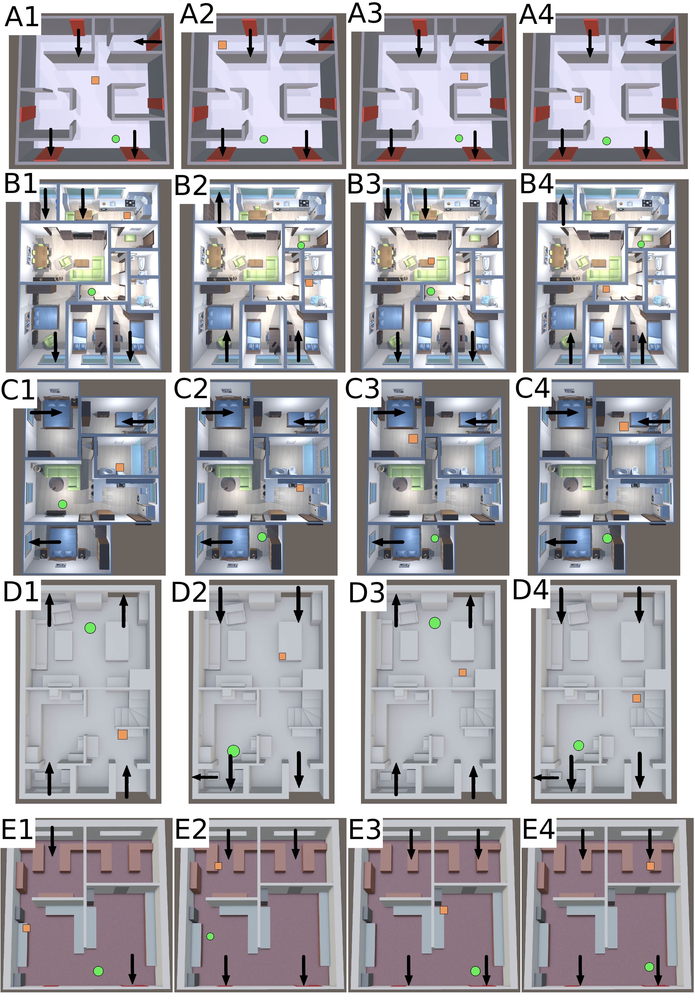

# Usage

You can run any specific simulation by doing:

```
ros2 launch pmfs_env gaden_preproc_launch.py scenario:=<scenario> simulation:=<simulation>
```

```
ros2 launch pmfs_env gaden_sim_launch.py scenario:=<scenario> simulation:=<simulation>
```

```
ros2 launch pmfs_env main_simbot_launch.py scenario:=<scenario> simulation:=<simulation> method:=<method>
```

The parameters for the simulation and the GSL algorithms can be modified under `scenarios/<scenario>/params` and `scenarios/<scenario>/simulations`.

# Scenarios

The following wimage shows the configuration used for each experiment. The source position is marked with a square, the starting robot position is marked with a circle, and the airflow inlets and outlets are marked with arrows.
